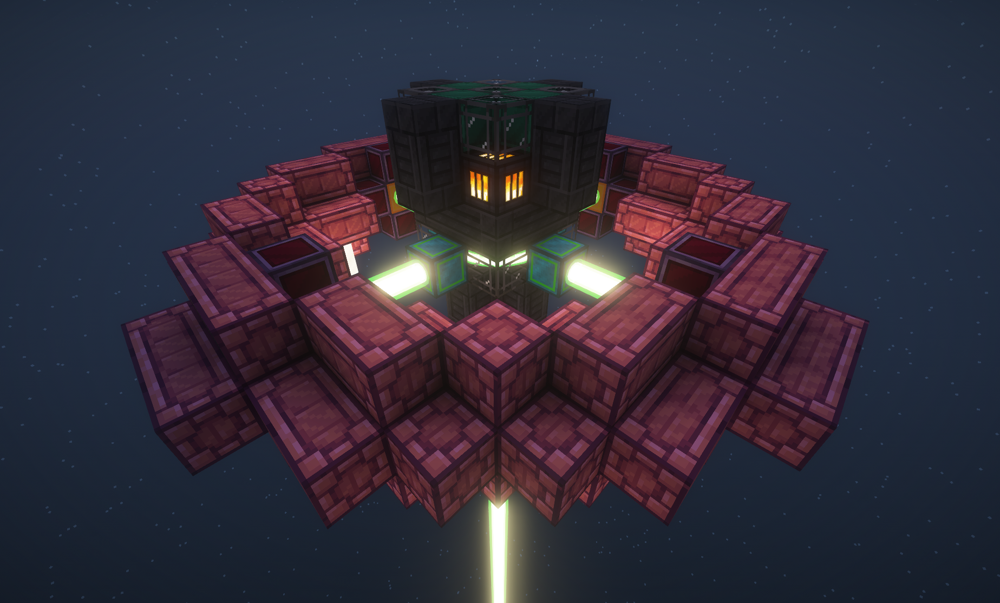
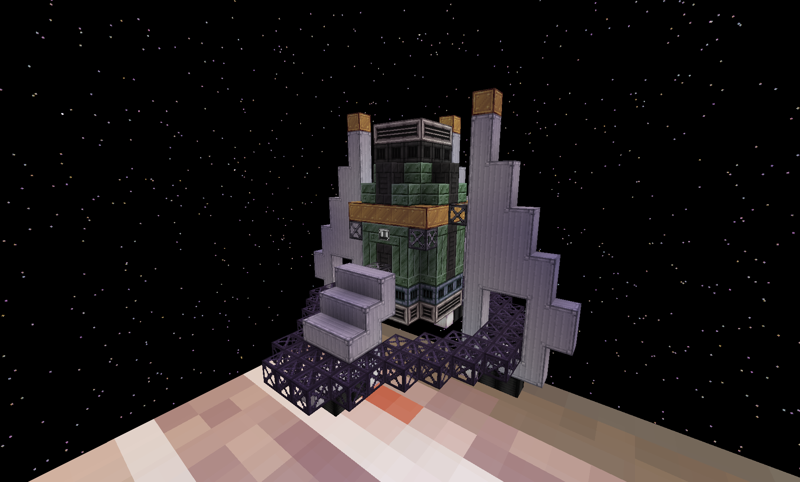

# gcyr extras

gcyre is an addon mod for [gregicality rocketry](https://github.com/Argent-Matter/gcyr). At present it does two things:

* adds 4 additional tiers of rocket & tank
* two new multiblocks + casings
* if [GT--](https://github.com/Arborsm/GT--) is present, it registers its rocket fuels as usable in rockets

The additional tiers provide modpack authors with extra flexibility in gating custom planets.

No recipes are provided for the additional rocket engines/tanks.

## orbital mining

Two new multiblocks allow "mining" from planets/moons from orbit. These are essentially void miners.

### orbital laser miner

Similar to the fusion ring, with its own custom renderer. LuV tier machine that produces ores in exchange for power+coolant. Ships with recipes for GCYR's
luna/mercury/venus/mars.

### orbital gas miner

A large multiblock gas collector that collects gas from orbit. Meant for gas giants, which may be added by pack authors. Only ships with an overworld recipe
that is mostly there for testing, where it functions as a slightly better version of the regular gas collector.

